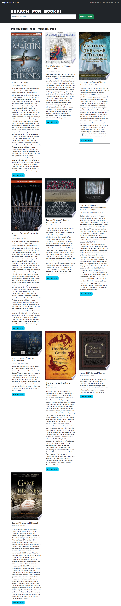
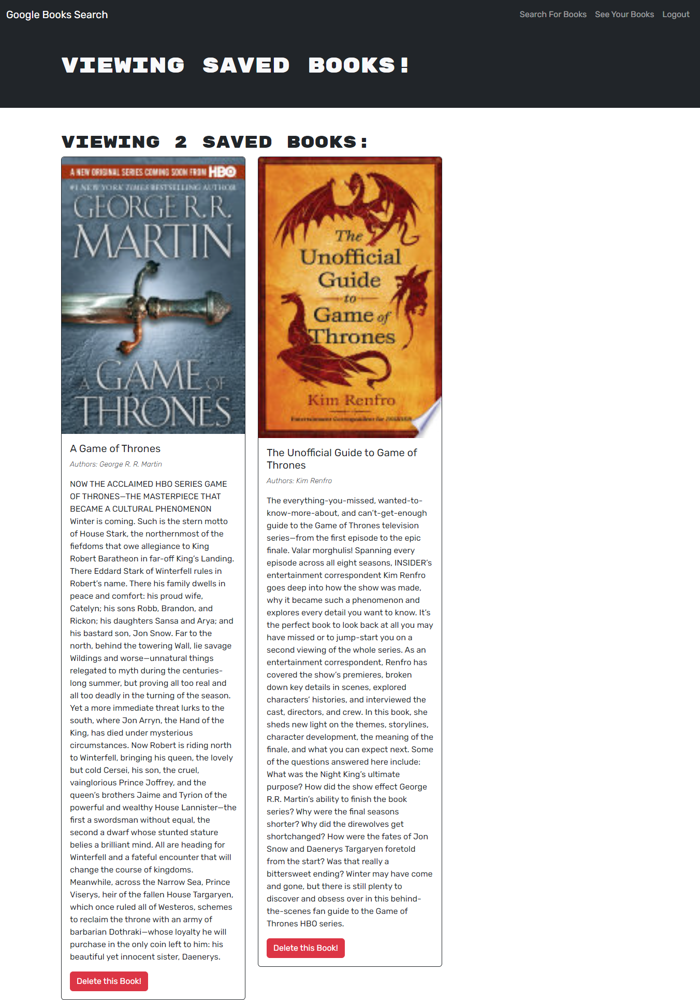
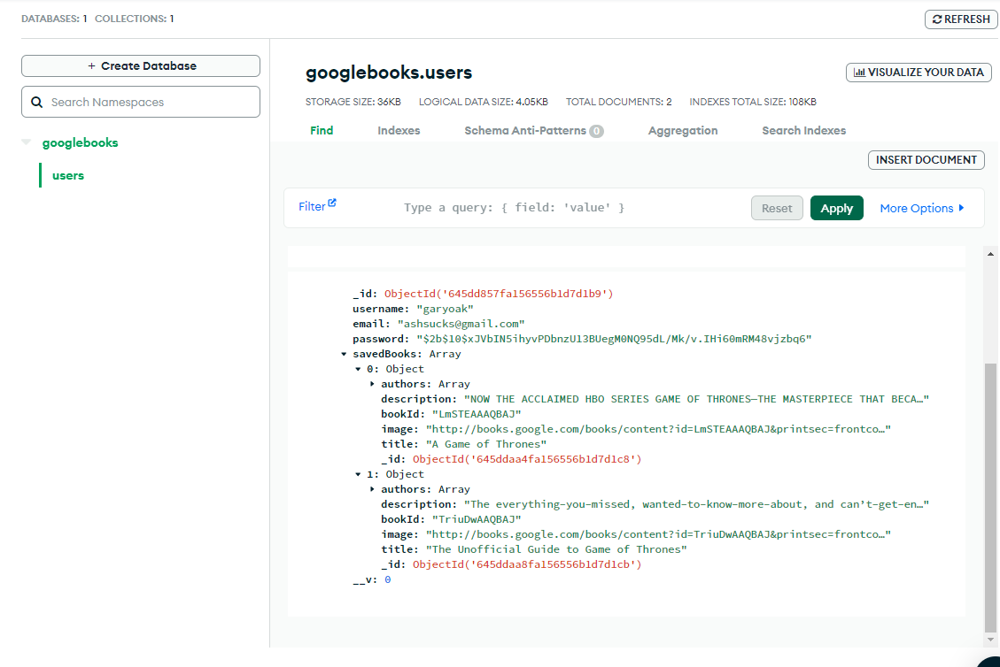

# 5-11-23-MERN-Book-Search-Engine

## Description

#### Using MERN framework, MongoDB Atlas and Google Books API to refactor the RESTful API for a search engine that allows users to sign up or login, search for books related to a keyword and then add/remove those books from their "saved books" page, while reflecting the information in the MongoDB Atlas database.
---

## Contents
- [User Story](#user-story)
- [Installation](#installation)
- [Media](#media)
- [Credits](#credits)
- [Technology Used](#technology-used)
- [License](#license)
​
### User Story
```md
AS AN avid reader
I WANT to search for new books to read
SO THAT I can keep a list of books to purchase
```
## Installation:

Utilizing the Application is simple!

Option A - Use the Heroku deployment directly by way of https://obscure-brook-20869.herokuapp.com/.

Option B - Clone the repo:
    
    git clone git@github.com:jmabie94/5-11-23-MERN-Book-Search-Engine.git

Next, open an integrated terminal in your cloned folder and do the following:
    
    run "npm init -y"
    run "npm i"

After Node Packages have installed, invoke the application:

    run "npm run develop"


Finally, the application should open automatically in your browser!
​
## Media

### Full Search Results Page:


### Saved Books Page in Browser:


### MongoDB Atlas Showing Saved Books:

​
## Credits
- Jack Mabie (https://github.com/jmabie94)
- Clarence (Our TA Helped Fix Some App-Breaking Issues!)
​
## Technology Used
    - Javascript
    - React
    - MongoDB Compass
    - MongoDB Atlas
    - Heroku
    - GraphQL
    - Apollo Client
    - MERN
    
## License
​
[](https://opensource.org/licenses/MIT)
​
MIT License
Copyright (c) [2023] [The Five Loopers]
Permission is hereby granted, free of charge, to any person obtaining a copy
of this software and associated documentation files (the "Software"), to deal
in the Software without restriction, including without limitation the rights
to use, copy, modify, merge, publish, distribute, sublicense, and/or sell
copies of the Software, and to permit persons to whom the Software is
furnished to do so, subject to the following conditions:
The above copyright notice and this permission notice shall be included in all
copies or substantial portions of the Software.
THE SOFTWARE IS PROVIDED "AS IS", WITHOUT WARRANTY OF ANY KIND, EXPRESS OR
IMPLIED, INCLUDING BUT NOT LIMITED TO THE WARRANTIES OF MERCHANTABILITY,
FITNESS FOR A PARTICULAR PURPOSE AND NONINFRINGEMENT. IN NO EVENT SHALL THE
AUTHORS OR COPYRIGHT HOLDERS BE LIABLE FOR ANY CLAIM, DAMAGES OR OTHER
LIABILITY, WHETHER IN AN ACTION OF CONTRACT, TORT OR OTHERWISE, ARISING FROM,
OUT OF OR IN CONNECTION WITH THE SOFTWARE OR THE USE OR OTHER DEALINGS IN THE
SOFTWARE.
​
---